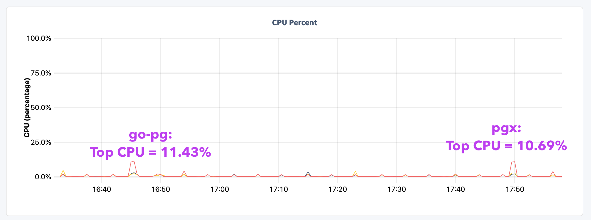

### POSTGRES STRESS TEST (8vCPUs): PGX

```shell
          /\      |‾‾| /‾‾/   /‾‾/   
     /\  /  \     |  |/  /   /  /    
    /  \/    \    |     (   /   ‾‾\  
   /          \   |  |\  \ |  (‾)  | 
  / __________ \  |__| \__\ \_____/ .io

  execution: local
     script: pgx-api/checkBalances.js
     output: -

  scenarios: (100.00%) 1 scenario, 10 max VUs, 1m0s max duration (incl. graceful stop):
           * default: 10 looping VUs for 30s (gracefulStop: 30s)


     ✓ status was 200

     checks.........................: 100.00% ✓ 49728       ✗ 0    
     data_received..................: 51 MB   1.7 MB/s
     data_sent......................: 6.5 MB  217 kB/s
     http_req_blocked...............: avg=3.64µs  min=0s     med=2µs    max=4.29ms p(90)=4µs    p(95)=5µs   
     http_req_connecting............: avg=132ns   min=0s     med=0s     max=808µs  p(90)=0s     p(95)=0s    
     http_req_duration..............: avg=5.91ms  min=1.29ms med=4.7ms  max=1.01s  p(90)=7.81ms p(95)=9.52ms
       { expected_response:true }...: avg=5.91ms  min=1.29ms med=4.7ms  max=1.01s  p(90)=7.81ms p(95)=9.52ms
     http_req_failed................: 0.00%   ✓ 0           ✗ 49728
     http_req_receiving.............: avg=45.17µs min=12µs   med=37µs   max=2.21ms p(90)=71µs   p(95)=91µs  
     http_req_sending...............: avg=13.04µs min=4µs    med=10µs   max=1.78ms p(90)=18µs   p(95)=24µs  
     http_req_tls_handshaking.......: avg=0s      min=0s     med=0s     max=0s     p(90)=0s     p(95)=0s    
     http_req_waiting...............: avg=5.85ms  min=1.24ms med=4.64ms max=1.01s  p(90)=7.75ms p(95)=9.45ms
     http_reqs......................: 49728   1657.388407/s
     iteration_duration.............: avg=6.01ms  min=1.37ms med=4.8ms  max=1.01s  p(90)=7.92ms p(95)=9.64ms
     iterations.....................: 49728   1657.388407/s
     vus............................: 10      min=10        max=10 
     vus_max........................: 10      min=10        max=10 


running (0m30.0s), 00/10 VUs, 49728 complete and 0 interrupted iterations
default ✓ [======================================] 10 VUs  30s
```


### POSTGRES STRESS TEST (8vCPUs): GO-PG

```shell
          /\      |‾‾| /‾‾/   /‾‾/   
     /\  /  \     |  |/  /   /  /    
    /  \/    \    |     (   /   ‾‾\  
   /          \   |  |\  \ |  (‾)  | 
  / __________ \  |__| \__\ \_____/ .io

  execution: local
     script: test-harness/gopg-checkBalances.js
     output: -

  scenarios: (100.00%) 1 scenario, 10 max VUs, 1m0s max duration (incl. graceful stop):
           * default: 10 looping VUs for 30s (gracefulStop: 30s)


     ✓ status was 200

     checks.........................: 100.00% ✓ 63127       ✗ 0    
     data_received..................: 68 MB   2.3 MB/s
     data_sent......................: 8.3 MB  276 kB/s
     http_req_blocked...............: avg=3.24µs  min=1µs    med=2µs    max=2.06ms  p(90)=4µs    p(95)=4µs   
     http_req_connecting............: avg=61ns    min=0s     med=0s     max=482µs   p(90)=0s     p(95)=0s    
     http_req_duration..............: avg=4.63ms  min=1.48ms med=4.17ms max=65.74ms p(90)=6.68ms p(95)=7.98ms
       { expected_response:true }...: avg=4.63ms  min=1.48ms med=4.17ms max=65.74ms p(90)=6.68ms p(95)=7.98ms
     http_req_failed................: 0.00%   ✓ 0           ✗ 63127
     http_req_receiving.............: avg=42.68µs min=12µs   med=35µs   max=4.9ms   p(90)=63µs   p(95)=82µs  
     http_req_sending...............: avg=12.95µs min=4µs    med=10µs   max=5.61ms  p(90)=17µs   p(95)=24µs  
     http_req_tls_handshaking.......: avg=0s      min=0s     med=0s     max=0s      p(90)=0s     p(95)=0s    
     http_req_waiting...............: avg=4.58ms  min=1.43ms med=4.11ms max=63.9ms  p(90)=6.62ms p(95)=7.92ms
     http_reqs......................: 63127   2103.743091/s
     iteration_duration.............: avg=4.73ms  min=1.57ms med=4.27ms max=67.9ms  p(90)=6.79ms p(95)=8.1ms 
     iterations.....................: 63127   2103.743091/s
     vus............................: 10      min=10        max=10 
     vus_max........................: 10      min=10        max=10 


running (0m30.0s), 00/10 VUs, 63127 complete and 0 interrupted iterations
default ✓ [======================================] 10 VUs  30s
```

> **Comparisons in Postgres**
> go-pg performed better by p(95)=1.27ms and avg 1.28ms difference at `avg=4.63ms  min=1.48ms med=4.17ms max=65.74ms p(90)=6.68ms p(95)=7.98ms`
> pgx lagged a few ms at `avg=5.91ms  min=1.29ms med=4.7ms  max=1.01s  p(90)=7.81ms p(95)=9.52ms`


### COCKROACHDB STRESS TEST (24vCPUs): PGX

```shell

          /\      |‾‾| /‾‾/   /‾‾/   
     /\  /  \     |  |/  /   /  /    
    /  \/    \    |     (   /   ‾‾\  
   /          \   |  |\  \ |  (‾)  | 
  / __________ \  |__| \__\ \_____/ .io

  execution: local
     script: pgx-api/pgx-checkBalances.js
     output: -

  scenarios: (100.00%) 1 scenario, 10 max VUs, 1m0s max duration (incl. graceful stop):
           * default: 10 looping VUs for 30s (gracefulStop: 30s)


     ✓ status was 200

     checks.........................: 100.00% ✓ 71264       ✗ 0    
     data_received..................: 10 MB   333 kB/s
     data_sent......................: 9.3 MB  311 kB/s
     http_req_blocked...............: avg=1.55µs min=0s     med=1µs    max=1.3ms    p(90)=2µs    p(95)=3µs   
     http_req_connecting............: avg=56ns   min=0s     med=0s     max=451µs    p(90)=0s     p(95)=0s    
     http_req_duration..............: avg=4.15ms min=1.57ms med=3.59ms max=188.8ms  p(90)=5.96ms p(95)=7.45ms
       { expected_response:true }...: avg=4.15ms min=1.57ms med=3.59ms max=188.8ms  p(90)=5.96ms p(95)=7.45ms
     http_req_failed................: 0.00%   ✓ 0           ✗ 71264
     http_req_receiving.............: avg=22.2µs min=4µs    med=16µs   max=12.5ms   p(90)=30µs   p(95)=43µs  
     http_req_sending...............: avg=6.56µs min=1µs    med=4µs    max=7.24ms   p(90)=10µs   p(95)=13µs  
     http_req_tls_handshaking.......: avg=0s     min=0s     med=0s     max=0s       p(90)=0s     p(95)=0s    
     http_req_waiting...............: avg=4.12ms min=1.55ms med=3.57ms max=188.76ms p(90)=5.91ms p(95)=7.41ms
     http_reqs......................: 71264   2374.884503/s
     iteration_duration.............: avg=4.2ms  min=1.58ms med=3.64ms max=190.85ms p(90)=6.03ms p(95)=7.55ms
     iterations.....................: 71264   2374.884503/s
     vus............................: 10      min=10        max=10 
     vus_max........................: 10      min=10        max=10 


running (0m30.0s), 00/10 VUs, 71264 complete and 0 interrupted iterations
default ✓ [======================================] 10 VUs  30s

```


## COCKROACHDB STRESS TEST (24vCPUs): GO-PG

```shell
          /\      |‾‾| /‾‾/   /‾‾/   
     /\  /  \     |  |/  /   /  /    
    /  \/    \    |     (   /   ‾‾\  
   /          \   |  |\  \ |  (‾)  | 
  / __________ \  |__| \__\ \_____/ .io

  execution: local
     script: gopg-api/gopg-checkBalances.js
     output: -

  scenarios: (100.00%) 1 scenario, 10 max VUs, 1m0s max duration (incl. graceful stop):
           * default: 10 looping VUs for 30s (gracefulStop: 30s)


     ✗ status was 200
      ↳  99% — ✓ 72639 / ✗ 1

     checks.........................: 99.99% ✓ 72639       ✗ 1    
     data_received..................: 10 MB  339 kB/s
     data_sent......................: 9.5 MB 317 kB/s
     http_req_blocked...............: avg=1.59µs  min=0s     med=1µs    max=2.39ms   p(90)=2µs    p(95)=3µs   
     http_req_connecting............: avg=67ns    min=0s     med=0s     max=562µs    p(90)=0s     p(95)=0s    
     http_req_duration..............: avg=4.07ms  min=1.62ms med=3.64ms max=142.48ms p(90)=5.51ms p(95)=6.77ms
       { expected_response:true }...: avg=4.07ms  min=1.62ms med=3.64ms max=142.48ms p(90)=5.51ms p(95)=6.77ms
     http_req_failed................: 0.00%  ✓ 1           ✗ 72639
     http_req_receiving.............: avg=20.51µs min=4µs    med=16µs   max=6.71ms   p(90)=28µs   p(95)=39µs  
     http_req_sending...............: avg=6.03µs  min=1µs    med=4µs    max=5.81ms   p(90)=9µs    p(95)=13µs  
     http_req_tls_handshaking.......: avg=0s      min=0s     med=0s     max=0s       p(90)=0s     p(95)=0s    
     http_req_waiting...............: avg=4.04ms  min=1.6ms  med=3.61ms max=142.42ms p(90)=5.48ms p(95)=6.73ms
     http_reqs......................: 72640  2420.813101/s
     iteration_duration.............: avg=4.12ms  min=1.64ms med=3.68ms max=145.05ms p(90)=5.58ms p(95)=6.86ms
     iterations.....................: 72640  2420.813101/s
     vus............................: 10     min=10        max=10 
     vus_max........................: 10     min=10        max=10 


running (0m30.0s), 00/10 VUs, 72640 complete and 0 interrupted iterations
default ✓ [======================================] 10 VUs  30s
```

### Findings:


> **Comparisons in CockroachDB**
> go-pg performed better by p(95)=0.68ms and avg 0.08ms difference at `avg=4.07ms  min=1.62ms med=3.64ms max=142.48ms p(90)=5.51ms p(95)=6.77ms`
> pgx lagged a few ms at `avg=4.15ms min=1.57ms med=3.59ms max=188.8ms  p(90)=5.96ms p(95)=7.45ms`
> CPU favored Pgx giving lower latency overall.
